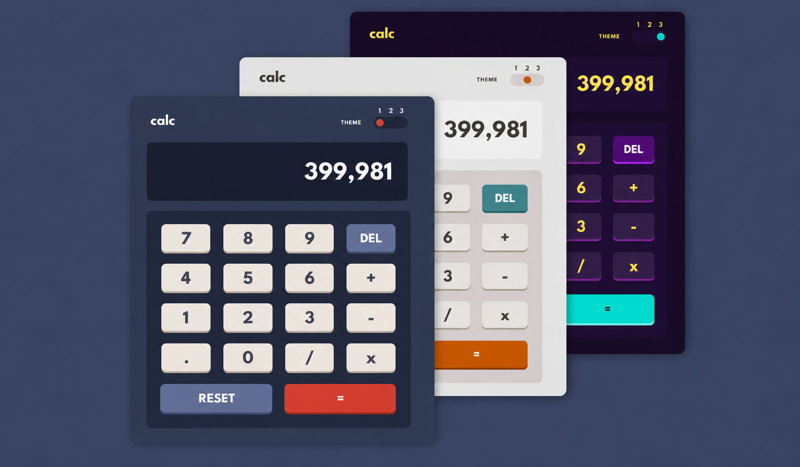

Calc — Multi-Theme Calculator

A clean, responsive calculator built with vanilla HTML, CSS, and JavaScript. Supports 3 themes with persistent storage and full keyboard support.

📸 Preview : 

🔗 Live Demo
[View Live](# https://mansityagi548.github.io/calculator/)

How to Run : 

Download or clone the project
Make sure all 3 files are in the same folder:

   index.html
   style.css
   script.js

Open index.html in your browser — that's it, no install needed

Features:

Basic arithmetic: +, -, x, /

Chaining calculations (e.g. 2 + 3 + 4 without pressing =)

Chaining after = (e.g. result of 2 + 3 then * 4)

DEL button with smart state detection

RESET button to wipe everything

Divide by zero handled gracefully

Floating point fix (e.g. 0.1 + 0.2 won't show 0.30000000004)

3 themes with toggle slider

Theme saved to localStorage — persists on reload

Fully responsive — works on mobile and desktop

